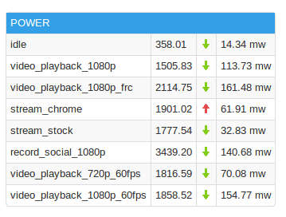
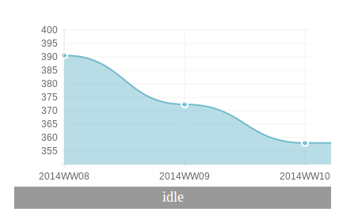
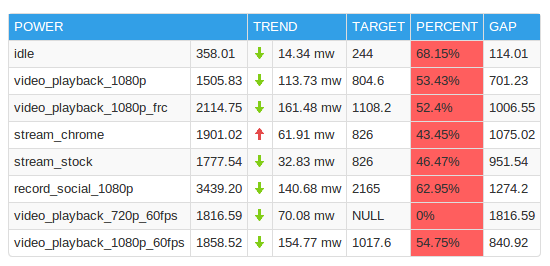

### WEEKLY WORK
1. MOOREFLD PRH MEASUREMENT & SOCWATCH ANALYSIS

### AUTO VPNP
1. [BUG] JQUERY AJAX DOES NOT WORK IN IE
    > The problem was caused by "console.log()". In IE Browser, program will get stuck
    when you print log in the console if you do not lanunch the console, however it works
    well while using Chrome & Firefox

2. [NEW FUNCTION] DATA COMPARSION IN WEB
> 

3. [NEW FUNCTION] DATA TREND IMAGE
> 

4. [COMPATIBILITY] Fixed the IE8 and IE8- compatibility of HTML Canvas with excanvas.js

5. [NEW FUNCTION] TARGETS SETTING
    > Set power target for different platforms and different devices

6. [NEW FEATURE] TARGET PERCENT & TARGET GAP IN POWER TABLE
> 

### MISC

1. [UCAD] have a basic knowledge of MOF UCAD
2. Take participate in Google Boot Camp Media Day Presentation
3. Take participate in OptoFidelity Solution for User Experience Measurement
